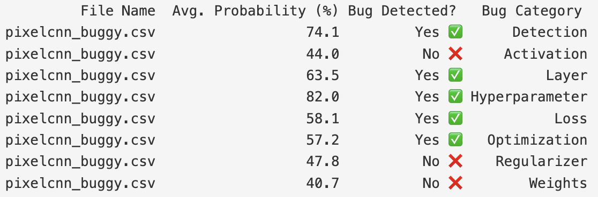

# **DEFault: A Framework for Fault Detection and Diagnosis in Deep Neural Networks**

Welcome to the replication package for **DEFault**, a framework designed to improve the detection and diagnosis of faults in Deep Neural Networks (DNNs). This repository provides all the necessary code and data to reproduce the experiments from our paper accepted at ICSE - Research Track 2025:

**"Improved Detection and Diagnosis of Faults in Deep Neural Networks using Hierarchical and Explainable Classification."**

The pre-print of the paper is available in this repository as **`K_Pre-Print.pdf`**.

---
## **Table of Contents**

1. [Introduction](#introduction)
2. [How DEFault Works](#how-default-works)
3. [Repository Structure](#repository-structure)
4. [Requirements](#requirements)
   - [Operating System](#operating-system)
   - [Hardware Requirements](#hardware-requirements)
   - [Software Requirements](#software-requirements)
5. [Usage](#usage)
   - [Quick Start: Lightweight Verification](#quick-start-lightweight-verification)
   - [Running the Complete Experiment](#running-the-complete-experiment)
6. [How to Cite](#how-to-cite)
7. [Authors](#authors)
8. [License](#license)

---
## **Introduction**

**DEFault** is a hierarchical classification framework that improves fault detection and diagnosis in DNNs by leveraging both static and dynamic analysis. It consists of three primary stages:

1. Fault Detection - Identifies faulty DNN programs based on runtime features.
2. Fault Categorization - Classifies detected faults into seven categories.
3. Root Cause Analysis - Uses explainable AI (SHAP) to pinpoint the most influential static and dynamic features contributing to faults.

**Illustrative Workflow**


---
## **How DEFault Works**

### **1. Fault Detection**
- Monitors runtime features such as loss trends, activation statistics, and gradient behaviors.
- Uses a trained classifier to detect if a DNN program contains faults.

### **2. Fault Categorization**
- Categorizes detected faults into one or more of the following seven categories:
  - Hyperparameter
  - Loss
  - Activation
  - Layer
  - Optimizer
  - Weight
  - Regularization
- Multiple binary classifiers are used for this classification.

### **3. Root Cause Analysis**
- Utilizes SHAP for explainability.
- Identifies the most influential static and dynamic features responsible for the fault.
- Helps developers diagnose and fix the root cause effectively.

---
## **Repository Structure**

```
DEFault
├── 0_Artifact_Testing       # Scripts for lightweight verification on sample DNN models
├── a_Data_Collection        # Scripts for collecting and processing StackOverflow posts
├── b_Fault_Seeding          # Scripts for fault injection (DeepCrime and EFI extension)
├── c_Feature_Extraction     # Static & Dynamic feature extraction scripts
├── d_DEFault                # Implementation of DEFault (Fault Detection, Categorization, RCA)
├── e_Evaluation             # Evaluation scripts for real-world and seeded faults
├── f_Figures                # Figures used in the paper
├── g_Dataset                # Labeled datasets for training and testing
├── h_CohenKappaAnalysis     # Scripts for dataset consistency validation (Cohen’s Kappa)
├── i_CaseStudy              # Scripts for real-world case studies (e.g., PixelCNN)
├── j_HPC_Slurm              # Slurm job script for Compute Canada
├── K_Pre-Print.pdf          # Pre-print of the full paper
```

---
## **Requirements**

### **Operating System**
**Tested on:**
- Ubuntu 20.04 LTS or later
- HPC environments (e.g., Compute Canada, Graham Cluster)

**Compatible with:**
- Windows 10/11 (via WSL2)
- macOS Monterey (M1/M2 support may require additional setup)

### **Hardware Requirements**

**Minimum:**
- CPU: 4 cores
- RAM: 8 GB
- Disk: 10 GB

**Recommended:**
- GPU: NVIDIA with CUDA support
- HPC access (e.g., Compute Canada) for full experiments

### **Software Requirements**

- **Python:** 3.10 or later

- **Create a virtual environment:**
```bash
python -m venv default_env
source default_env/bin/activate   # macOS/Linux
default_env\Scripts\activate      # Windows
```

- **Install dependencies:**
```bash
pip install -r requirements.txt
```
---
## **Usage**

### **Quick Start: Lightweight Verification**

1. **Navigate to the evaluation scripts directory:**
```bash
cd 0_Artifact_Testing/evaluation_scripts
```

2. **Run the Fault Detection & Categorization (FD_FC) script:**
```bash
python testForCaseStudy_FD_FC.py
```
**Expected Output:**



- Fault Detection (FD): Confirms if the PixelCNN model has faults.
- Fault Categorization (FC): Identifies the type of faults, including:
  - Loss Function Fault
  - Hyperparameter Fault
  - Layer Fault
- Note: The model mistakenly identify an Optimization Fault due to feature overlap.

3. **Run the Root Cause Analysis (RCA) script:**
```bash
python testForCaseStudy_RCA.py
```
**Expected Output:**
- Identifies the root causes of the Layer Fault using static features:
  - Top@1: CountDense - Check the number of Dense layers.
  - Top@2: Max_Neurons - Verify the maximum number of neurons in any layer.
  - Top@3: CountConv2D - Inspect Conv2D layer configurations.

---
### **Running the Complete Experiment**

**Download the dataset:**
- **DNN Programs:** [Download Link](https://bit.ly/3Cw0vOB)
- **Evaluation Benchmark:** [Download Link](https://bit.ly/3CQPozK)

1. **Data Collection & Fault Seeding:**
```bash
# Run Part 1 (Deep Crime) - Must have HPC support
cd b_Fault_Seeding/Part 1-DC
python run_deepcrime_full.py
# Run Part 2 (Extended Fault Injection) - Must have HPC support
cd b_Fault_Seeding/Part 2-EFI
python main.py
```

2. **Feature Extraction:**
```bash
cd c_Feature_Extraction/Static
python Static_Feature_Extraction.py
```
```bash
cd c_Feature_Extraction/Dynamic
python Dynamic_Feature_Extraction.py
```

3. **Model Training:**
```bash
cd d_DEFault/A_Detection
python Fault_Detection.py
```

4. **Model Evaluation:**
```bash
cd e_Evaluation
python Fault_Evaluation_Detection_Diagnosis.py
```

5. **Case Studies:**
```bash
cd i_CaseStudy
python Feature_Extraction_CaseStudy.py
python PixelCNN_Analysis.py
```

---
## **How to Cite**

```bibtex
@inproceedings{default2025,
  author    = {Sigma Jahan and Mehil B Shah and Parvez Mahbub and Mohammad Masudur Rahman},
  title     = {Improved Detection and Diagnosis of Faults in Deep Neural Networks using Hierarchical and Explainable Classification},
  booktitle = {Proceedings of the International Conference on Software Engineering (ICSE)},
  year      = {2025},
  publisher = {IEEE}
}
```

---
## **Authors**
- **Sigma Jahan** - Dalhousie University, sigma.jahan@dal.ca  
- **Mehil B Shah** - Dalhousie University, shahmehil@dal.ca  
- **Parvez Mahbub** - Dalhousie University, parvezmrobin@dal.ca  
- **Mohammad Masudur Rahman** - Dalhousie University, masud.rahman@dal.ca  
---
## **License**

This project is licensed under the **MIT License**. See `LICENSE` for details.
