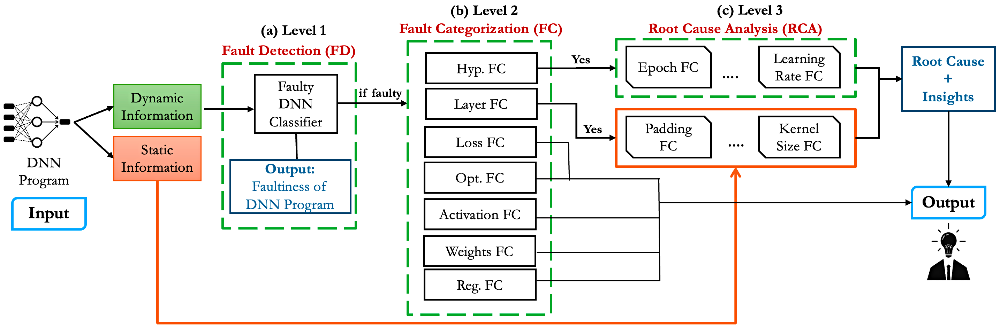

# DEFault: Detection and Diagnosis of Faults in Deep Neural Networks

[](https://default-ai.com/)
[](https://dl.acm.org/doi/10.1109/ICSE55347.2025.00224)
[](https://doi.org/10.5281/zenodo.20337241)

Replication package for the ICSE 2025 paper:

> **Improved Detection and Diagnosis of Faults in Deep Neural Networks Using Hierarchical and Explainable Classification**
> Sigma Jahan, Mehil B. Shah, Parvez Mahbub, Mohammad Masudur Rahman. Dalhousie University, Halifax, NS, Canada.
> ICSE 2025. DOI: [10.1109/ICSE55347.2025.00224](https://dl.acm.org/doi/10.1109/ICSE55347.2025.00224)

DEFault (Detect and Explain Faults) detects and diagnoses faults in DNN programs. It captures dynamic (runtime) features during model training and uses a hierarchical classifier to detect a fault and name its category. It then reads static features from the program and uses SHAP to explain the root cause. DEFault is trained on a dataset of about 14.5K DNN programs and evaluated on a benchmark of 52 real-world faulty DNN programs.

## How DEFault Works



A DNN program enters as input, and DEFault reads both its dynamic (runtime) and static information. The work then runs through three levels:

- **Level 1, Fault Detection.** A single classifier decides whether the program is faulty. If it is not, the analysis stops.
- **Level 2, Fault Categorization.** Seven classifiers run in parallel to name the fault type (Hyperparameter, Layer, Loss, Optimization, Activation, Weights, Regularization). A program can match more than one.
- **Level 3, Root Cause Analysis.** For hyperparameter and layer faults, finer classifiers and a SHAP explainer pin down the specific cause (for example, learning rate, epochs, kernel size, or padding).

The output is the root cause plus readable insights a developer can act on.

## Headline Results

- Fault detection on the test set: 97.0% accuracy (Table IV).
- Fault categorization on the test set: 92.2% accuracy (Table V).
- Real-world benchmark of 52 programs: 94.3% detection accuracy, 63.5% diagnosis accuracy.
- Improvement over the closest baseline (DeepFD): +3.92% detection, +11.54% categorization.

All numbers above are the values reported in the paper.

## Repository Layout

Each folder is one step of the method in the paper (Section IV, Fig. 1). The folders read top to bottom in the order the method runs.

| Folder | Paper section | Contents |
|--------|---------------|----------|
| [paper/](paper/) | - | The manuscript PDF |
| [data_collection/](data_collection/) | IV-A | Collected and filtered StackOverflow DNN programs |
| [fault_seeding/](fault_seeding/) | IV-D | Mutation operators that inject faults, plus the Deep4ge generation framework and its docs |
| [feature_extraction/](feature_extraction/) | IV-E | Dynamic logging callback and static feature extractor |
| [default/](default/) | IV-F to IV-H | The three-level classifier: detection, categorization, root cause analysis |
| [evaluation/](evaluation/) | V | Evaluation scripts, results workbook, and Deep4ge analysis code |
| [case_study/](case_study/) | VI | PixelCNN program (correct and buggy variants) |
| [artifact_testing/](artifact_testing/) | VI | Self-contained reproduction of the case-study results on bundled sample features |
| [reliability/](reliability/) | IV-C | Cohen Kappa inter-rater agreement CSVs |
| [figures/](figures/) | various | Figures used in the paper |
| [hpc/](hpc/) | - | Slurm job scripts for cluster runs |

## Where Each Level Lives in the Code

The three levels in the diagram above map to [default/](default/) as follows.

1. **Fault Detection (L1)** in [default/A_Detection/](default/A_Detection/). A binary classifier on dynamic features decides whether a program is faulty.
2. **Fault Categorization (L2)** in [default/B_Categorization/](default/B_Categorization/). Seven binary classifiers, one per category, name the fault type: Hyperparameter, Layer, Loss, Activation, Optimization, Weight, Regularization. A program can carry more than one category.
3. **Root Cause Analysis (L3)** in [default/C_RootCauseAnalysis/](default/C_RootCauseAnalysis/). For hyperparameter faults, finer classifiers pin the cause to learning rate, batch size, epochs, or disable batching. For layer faults, an explainer module ranks static features with SHAP to point at the cause.

The base learner is Random Forest, tuned with grid search and 5-fold cross-validation.

## The Dataset (Deep4ge)

DEFault is trained on Deep4ge, a dataset of training logs from mutated DNN programs. Deep4ge is published separately as a dataset paper and archived on Zenodo. The training logs are not committed here. Download them from the archive:

> Deep4ge dataset. DOI [10.5281/zenodo.20337241](https://doi.org/10.5281/zenodo.20337241)

What lives in this repo instead of the data:

- The mutation framework that generates the dataset, in [fault_seeding/deep4ge_framework/](fault_seeding/deep4ge_framework/) (34 operators, including the 10 new layer operators for CNN and RNN).
- The dataset documentation, in [fault_seeding/docs/](fault_seeding/docs/) (operator catalog, data dictionary, provenance, seed attribution).
- The Deep4ge analysis scripts (baselines, statistics, figures), in [evaluation/deep4ge_analysis/](evaluation/deep4ge_analysis/).

The released dataset holds 14,227 training logs (9,845 faulty, 4,382 correct) from 60 StackOverflow seed programs across FNN, CNN, and RNN, with 26 dynamic features logged per epoch. The paper reports the experiment-time counts (14,652 mutants, 9,855 faulty, 4,797 correct, 23 features fed to the classifiers). The two differ because the released artifact drops crashed runs and merges some intermediate signals. See [fault_seeding/docs/PROVENANCE.md](fault_seeding/docs/PROVENANCE.md) and [fault_seeding/docs/DEEP4GE_DATASET_README.md](fault_seeding/docs/DEEP4GE_DATASET_README.md).

## The Tool

DEFault is available as a hosted web tool. Paste a Keras model or train one in the browser, and the tool runs all three levels with live training charts and SHAP root-cause hints.

### [Try DEFault online at default-ai.com](https://default-ai.com/)

The tool source is maintained in its own repository and is not part of this replication package. This repo holds the research code, the method, and the trained models behind the tool.

## Quick Reproduction

The fastest way to see the method work is the case-study artifact, which ships sample features so it runs without the full dataset.

```bash
pip install -r requirements.txt
cd artifact_testing
python evaluation_scripts/testForCaseStudy_FD_FC.py   # detection + categorization
python evaluation_scripts/testForCaseStudy_RCA.py      # root cause analysis
```

The root-cause script also needs the labeled static-feature table from the Deep4ge dataset on Zenodo. Set `DEFAULT_STATIC_FEATURES_CSV` to the downloaded `static_features_df.csv`, or place it in `artifact_testing/data/`. See [artifact_testing/README.md](artifact_testing/README.md).

## Citation

```bibtex
@inproceedings{jahan2025default,
  title     = {Improved Detection and Diagnosis of Faults in Deep Neural Networks Using Hierarchical and Explainable Classification},
  author    = {Jahan, Sigma and Shah, Mehil B. and Mahbub, Parvez and Rahman, Mohammad Masudur},
  booktitle = {Proceedings of the IEEE/ACM 47th International Conference on Software Engineering (ICSE)},
  year      = {2025},
  doi       = {10.1109/ICSE55347.2025.00224}
}
```

## License

MIT (see [LICENSE](LICENSE)). The Deep4ge dataset files on Zenodo are released under CC BY 4.0; see [fault_seeding/docs/LICENSE_DATASET_CC_BY_4.0.md](fault_seeding/docs/LICENSE_DATASET_CC_BY_4.0.md). StackOverflow seed programs follow their source-post licenses; see [fault_seeding/docs/SEED_ATTRIBUTION.md](fault_seeding/docs/SEED_ATTRIBUTION.md).
